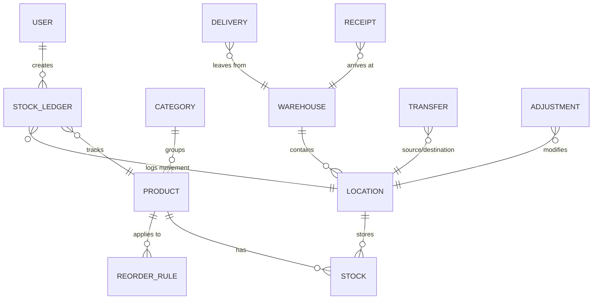
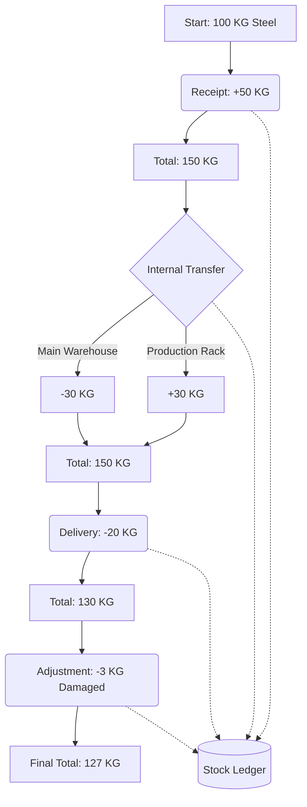

# StockSense – Modular Inventory Management System (IMS)

## 📌 Project Overview
StockSense is a centralized Inventory Management System designed to replace manual registers, Excel sheets, and scattered inventory tracking methods with a real-time, easy-to-use digital platform.

The system helps businesses manage the complete inventory lifecycle, including product management, incoming stock, outgoing stock, internal transfers, stock adjustments, warehouse management, stock tracking, and inventory analytics.

### Target Users
- **Inventory Managers:** Manage incoming and outgoing stock, monitor inventory levels, manage products and warehouses, and track inventory operations.
- **Warehouse Staff:** Receive goods, pick and pack products, perform internal transfers, conduct physical stock counting, and manage shelving and locations.

---

## ✨ Key Features

### Authentication
- User signup, login, and logout.
- Secure JWT-based authentication.
- OTP-based password reset.
- Protected routes and user profile management.

### Dynamic Dashboard
Real-time inventory KPIs and metrics:
- Total Products in Stock, Low Stock Items, Out of Stock Items, Pending Receipts, Pending Deliveries, Scheduled Internal Transfers.
- **Dynamic filters:** Document type, Status, Warehouse, Location, and Product category.
- **Supported statuses:** Draft, Waiting, Ready, Done, Canceled.

### Comprehensive Product Management
- Create, update, and delete products.
- SKU / product code generation, product category, unit of measure, and initial stock.
- Product search, filtering, stock availability by location, and reordering rules.

### Inventory Operations
- **Receipts:** Manage incoming goods from suppliers (Create Receipt → Add Supplier → Add Products → Enter Quantity → Validate → Increase Stock).
- **Delivery Orders:** Manage outgoing goods (Create Delivery → Pick → Pack → Validate → Decrease Stock).
- **Internal Transfers:** Move stock between internal locations (e.g., Rack A to Rack B) without changing total company stock.
- **Inventory Adjustments:** Reconcile physical stock differences with recorded system stock.

### Stock Ledger
Every inventory movement is recorded in the stock ledger. Operations include Receipts, Deliveries, Internal Transfers, and Adjustments. The ledger provides a complete audit trail showing:
Product, Operation type, Quantity, Source location, Destination location, Previous stock, Updated stock, User, and Timestamp.

### Multi-Warehouse Support
Support for multiple warehouses, locations, racks, and storage areas. Stock is tracked separately by warehouse and location.

### Low Stock Alerts
Notify inventory managers when stock reaches the reorder level or becomes out of stock.

---

## 🛠️ Technology Stack

**Frontend:**
- React, Vite, Tailwind CSS, React Router, Axios

**Backend:**
- Node.js, Express.js, MongoDB, Mongoose, JWT, bcrypt, Nodemailer (OTP service)

**Development Tools:**
- Git, GitHub, Postman, npm

---

## 🏗️ Project Architecture

StockSense follows a clear separation of concerns using a modern client-server architecture:

- **Frontend:** Built with React and Vite. The React UI consumes API Services which handle all HTTP requests to the Backend API.
- **Backend:** A RESTful API built with Node.js and Express. Requests flow sequentially through the stack:
  `Routes` → `Middleware` → `Controllers` → `Services` → `Models` → `MongoDB`

---

## 📂 Folder Structure

```text
stocksense/
├── frontend/
│   ├── public/
│   └── src/
│       ├── assets/
│       ├── components/
│       ├── pages/
│       ├── services/
│       ├── context/
│       ├── hooks/
│       ├── utils/
│       ├── routes/
│       ├── App.jsx
│       └── main.jsx
│
├── backend/
│   └── src/
│       ├── config/
│       ├── models/
│       ├── controllers/
│       ├── services/
│       ├── routes/
│       ├── middleware/
│       ├── validators/
│       ├── utils/
│       ├── constants/
│       ├── jobs/
│       ├── app.js
│       └── server.js
│
├── README.md
└── .gitignore
```

---

## 🚀 Installation

Follow these steps to set up the project locally.

1. **Clone the repository:**
   ```bash
   git clone <repository-url>
   cd stocksense
   ```

2. **Frontend Setup:**
   ```bash
   cd frontend
   npm install
   npm run dev
   ```

3. **Backend Setup:**
   Open a new terminal window:
   ```bash
   cd backend
   npm install
   npm run dev
   ```
   *(Ensure MongoDB is running locally or provide a MongoDB URI in your `.env` file.)*

---

## 🔐 Environment Variables

Create a `.env` file in the respective directories before starting the application. Do not include real secrets in version control.

**Backend (`backend/.env`):**
```env
PORT=
MONGODB_URI=
JWT_SECRET=
JWT_EXPIRES_IN=
EMAIL_USER=
EMAIL_PASSWORD=
```

**Frontend (`frontend/.env`):**
```env
VITE_API_URL=
```

---

## 🗄️ Database Design

The database is built on MongoDB using Mongoose schemas. The main entities include:
`User`, `Product`, `Category`, `Warehouse`, `Location`, `Stock`, `Receipt`, `Delivery`, `Transfer`, `Adjustment`, `StockLedger`, and `ReorderRule`.

### Entity Relationship Diagram



---

## 📡 API Documentation

Below are example API endpoints grouped by module:

**Authentication:**
- `POST /api/auth/signup`
- `POST /api/auth/login`
- `POST /api/auth/forgot-password`
- `POST /api/auth/verify-otp`
- `POST /api/auth/reset-password`

**Products:**
- `GET /api/products`
- `POST /api/products`
- `GET /api/products/:id`
- `PUT /api/products/:id`
- `DELETE /api/products/:id`

**Warehouses:**
- `GET /api/warehouses`
- `POST /api/warehouses`
- `PUT /api/warehouses/:id`
- `DELETE /api/warehouses/:id`

**Stock:**
- `GET /api/stock`
- `GET /api/stock/product/:productId`
- `GET /api/stock/warehouse/:warehouseId`

**Receipts:**
- `GET /api/receipts`
- `POST /api/receipts`
- `GET /api/receipts/:id`
- `POST /api/receipts/:id/validate`

**Deliveries:**
- `GET /api/deliveries`
- `POST /api/deliveries`
- `GET /api/deliveries/:id`
- `POST /api/deliveries/:id/validate`

**Transfers:**
- `GET /api/transfers`
- `POST /api/transfers`
- `GET /api/transfers/:id`
- `POST /api/transfers/:id/validate`

**Adjustments:**
- `GET /api/adjustments`
- `POST /api/adjustments`
- `POST /api/adjustments/:id/validate`

**Dashboard:**
- `GET /api/dashboard/overview`
- `GET /api/dashboard/low-stock`
- `GET /api/dashboard/pending-receipts`
- `GET /api/dashboard/pending-deliveries`

---

## 🔄 Inventory Workflow

StockSense tracks every change in physical stock. Below is an example lifecycle of inventory operations.

### Example Inventory Calculation
* **Initial stock:** 100 KG Steel
* **Receipt:** +50 KG (Total: 150 KG)
* **Internal transfer:** Move 30 KG from Main Warehouse to Production Rack (Main Warehouse -30 KG, Production Rack +30 KG). *Note: Internal transfers only change the stock location, they do not change the total company stock.*
* **Delivery:** -20 KG (Total: 130 KG)
* **Adjustment:** -3 KG damaged stock found (Total: 127 KG)
* **Final total stock:** 127 KG

Every operation above is securely recorded in the **Stock Ledger**.

### Process Flowchart



---

## 🛡️ Authentication Flow

- **Standard Flow:** Signup → Password Hashing → Database → Login → JWT → Protected Routes
- **Recovery Flow:** Forgot Password → OTP → OTP Verification → New Password

---

## 🧪 Testing

The platform implements testing covering all critical inventory flows:
- Authentication testing (Signup, Login, OTP verification)
- Product CRUD testing
- Stock calculation testing
- Receipt, Delivery, and Transfer testing
- Adjustment testing and Ledger verification
- Thorough API testing using Postman

---

## 👥 Team Contribution

The project is developed collaboratively by 3 team members:

- **Member 1:** Authentication + Product Management (Authentication, OTP password reset, User profile, Products, Categories, SKU management)
- **Member 2:** Warehouse + Stock Management (Warehouses, Locations, Stock engine, Multi-warehouse inventory, Reorder rules, Low-stock logic)
- **Member 3:** Operations + Dashboard (Receipts, Deliveries, Internal transfers, Inventory adjustments, Stock ledger, Dashboard, Inventory filters)

---

## 🔒 Security

The following security practices are implemented in the project:
- Password hashing with bcrypt
- JWT authentication
- Protected API routes
- Input validation
- Environment variables for secrets
- Secure error handling
- OTP expiration

*Planned security features:*
- Role-based authorization
- API rate limiting

---

## 🚀 Future Improvements

- Barcode / QR scanning
- Purchase order integration
- Sales order integration
- Supplier and Customer management
- Inventory forecasting and AI-based demand prediction
- Advanced analytics
- Export reports to Excel/PDF
- Email notifications
- Mobile application
- Role-based permissions and audit logs

---

## 📄 License
This project is licensed under the MIT License.
